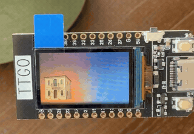
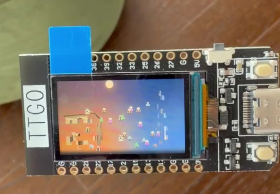

# Migration

**Kira Dabbagh · Module 1: Generative Art · Creative Embedded Systems, Fall 2026**

This piece comes from my move from Lebanon to New York. I wanted to show that moving away does not mean leaving everything behind. Family, small routines, and memories travel with you and become part of the next place you call home.

A traditional Lebanese stone house slowly breaks apart. Its pieces turn into small cedars, coffee cups, people, grandparents, and suitcases. They take different paths across the screen before coming together as a glass skyscraper in New York. One sun rises over Lebanon and sets in New York, connecting the two places. The warm orange and cool blue backgrounds emphasize how different these homes feel.



*Cropped from a recording of the actual board, at normal speed. The GIF captures one journey; the device generates new ones each time. [Watch the full video with audio](https://drive.google.com/file/d/1OigV7Otc-mpTzNrZS5rKmh2dtK5_G-JO/view).*

## What makes it generative?

The buildings are fixed image assets, but the movement between them is calculated while the program runs. Arduino’s `random()` chooses departure times, destinations within the new building, path bends, travel speeds, and moments when a piece slows down or briefly turns back. A few pieces wait longer before leaving. Every piece eventually arrives.

The trip from the complete house to the complete tower takes roughly 40 seconds, with some variation. After a short pause, the tower fades and the house returns for another journey. The program does not play a saved video or cycle through a list of finished frames.

## What you need

- An **original ESP32 TTGO T-Display**, with its built-in 135 × 240 ST7789 screen. This setup is for the original ESP32 board, not the T-Display S3.
- A USB-C **data** cable and a computer.
- A compatible LiPo battery for running the piece away from the computer. The class supplied the battery for the installation; its connector and polarity must match the board.
- For the class installation: a small paper envelope with the screen visible, plus the class mounting materials.

There is no external display wiring, SD card, Wi-Fi connection, or additional sensor. The images are stored in the program.

## Run it on your own board

These are the versions used for this project on macOS:

| Software | Version |
| --- | --- |
| Arduino IDE | 2.3.10 |
| esp32 by Espressif Systems | 2.0.14 |
| TFT_eSPI by Bodmer | 2.5.43 |

1. Download this repository using **Code → Download ZIP**, then unzip it. Open `module-1/migration/migration.ino` in the [Arduino IDE](https://www.arduino.cc/en/software). Keep `photos.h` in the same `migration` folder.
2. In Arduino IDE settings, add this URL to **Additional boards manager URLs**:

   ```text
   https://espressif.github.io/arduino-esp32/package_esp32_index.json
   ```

   Follow the [Espressif installation instructions](https://docs.espressif.com/projects/arduino-esp32/en/latest/installing.html): open Boards Manager and install **esp32 by Espressif Systems**, version **2.0.14**. Using this version matters because the sketch uses its ESP32 random-seed API.
3. In Library Manager, install **TFT_eSPI by Bodmer**, version **2.5.43**.
4. Configure TFT_eSPI for this screen. In your sketchbook’s `libraries/TFT_eSPI/User_Setup_Select.h`, comment out the default `#include <User_Setup.h>` and enable this line:

   ```cpp
   #include <User_Setups/Setup25_TTGO_T_Display.h>
   ```

   Only one display setup should be enabled. On this Mac, the library was in `~/Documents/Arduino/libraries/TFT_eSPI/`. Check the sketchbook location in IDE settings if yours is elsewhere. A library reinstall or update can reset this selection.
5. Connect the board using the data cable. Select **ESP32 Dev Module**, its USB serial port, and an upload speed of **115200**. Leave the other board settings at their defaults.
6. Click **Verify**, then **Upload**. When the upload finishes, the board restarts and the house appears. Give the animation about 40 seconds to reach the complete tower.
7. For portable operation, use the compatible class LiPo battery connected to the board’s battery socket. The sketch starts automatically when powered and stays stored after unplugging USB. Actual battery life depends on the battery; this project does not claim a measured runtime.

The display setup handles the board’s built-in connections: MOSI 19, clock 18, CS 5, DC 16, reset 23, and backlight 4. `setRotation(1)` makes the artwork landscape, at 240 × 135 pixels. These are reference values, not instructions to add jumper wires.

### If something does not work

- **No serial port:** try a known data cable and another USB connection first. This board appeared as a WCH USB serial device on the project Mac. If your Mac needs a driver, use the [official WCH CH34x Mac driver](https://www.wch-ic.com/downloads/CH34XSER_MAC_ZIP.html). Other board revisions may use a different USB chip.
- **Upload succeeds but the screen is blank:** check that Setup25 is the only enabled TFT_eSPI setup, then compile and upload again.
- **The screen shows the original Wi-Fi/voltage demo:** the custom sketch has not replaced the factory program yet. Check the selected board and port, then upload again.
- **`bootloader_random.h` cannot be found:** check that the Espressif board package is version 2.0.14.

## Finding your way around the code

- [`migration/migration.ino`](migration/migration.ino): movement, timing, the single sun, the sky, and the small keepsake drawings.
- [`migration/photos.h`](migration/photos.h): generated RGB565 image data, transparency, and tile positions. It is included so you can upload without converting any images yourself.
- [`migration/assets/`](migration/assets/): the original building images and their generation prompts.
- [`tools/prepare_photos.py`](tools/prepare_photos.py): optional image conversion script. It requires Python and Pillow; it is not needed to run the supplied sketch.

`prepareJourney()` chooses a piece’s route and timing. `updateParticles()` moves the pieces between four states: home, traveling, settled, and returning. `renderFragment()` draws the building pieces, while `renderKeepsake()` briefly turns each traveler into its symbol. `renderSky()` moves the same sun from left to right. The finished frame is drawn off-screen and then sent to the display to reduce flicker.

To experiment, change `MIGRATION_SPEED` near the top of the sketch, the waiting and travel ranges in `prepareJourney()`, or the `KEEPSAKES` pixel patterns. Each symbol stays with the same piece during its trip. Increasing `MIGRATION_SPEED` makes the journey faster; the pauses for viewing the buildings stay separate.

## Installation documentation

The class installation was scheduled for October 1–2, 2026, with battery-powered boards hanging in small paper envelopes. The [device demo](https://drive.google.com/file/d/1OigV7Otc-mpTzNrZS5rKmh2dtK5_G-JO/view) and the still below show the working board on a table. They do not show the hanging envelope installation; a photo of that setup is not included yet.



*Still extracted from the device demo.*

## Credits

The idea and visual direction are based on my experience moving from Lebanon to New York. I developed the sketch with assistance from OpenAI Codex. The two architectural images were made with OpenAI’s image generator; they are imagined buildings, not photographs of my actual homes. The prompts are saved in [`generation-prompts.json`](migration/assets/generation-prompts.json).

The display uses [Bodmer’s TFT_eSPI](https://github.com/Bodmer/TFT_eSPI) and the [Espressif Arduino core](https://github.com/espressif/arduino-esp32). The hardware setup builds on the course’s Lab 1 TFT display exercise.
